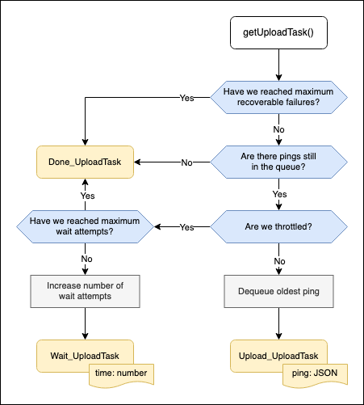

# Ping Uploading

This document describes how Glean.js handles ping uploading.

It is not a straight line from the moment a ping is [submitted](https://mozilla.github.io/glean/book/reference/pings/index.html#submit)
to the moment it is uploaded to the telemetry servers. Even though the aim is that submission will
trigger upload immediatelly, multiple factors need to be accounted for that may delay upload such as:
rate limitations, network errors and user interactions e.g. a user closing the application before
Glean is able to upload a ping.

There are three main internal structures that handle ping upload orchestration and resiliency
inside the Glean.js codebase. These are: the `PingsDatabase`, the `PingUploadManager` and the
`PingUploadWorker`.

## `PingsDatabase`

The `PingsDatabase`, as the name suggests, is a database for storing pings. It is different from the
`MetricsDatabase` and `EventsDatabase`, in the sense that it contains the ping data _after collection_
i.e. it contains full JSON ping payloads instead of isolated metric data.

As soon as a new ping is [collected](https://mozilla.github.io/glean/book/appendix/glossary.html#submission)
it is persisted on the `PingsDatabase`.

The `PingsDatabase` is an observable class. Whenever a new ping is recorded, observers are notified.
When this class is initialized it scans the underlying database for any pending pings
from the previous run. Observers are also notified of each ping found while scanning.

## `PingUploadManager`

The `PingUploadManager` is responsible for managing a queue of pings to upload and for dealing with
upload responses. It is also responsible for applying limitations to ping uploads. It observes the
`PingsDatabase`. Whenever it is notified of a new ping, that ping is added to the queue and
the `PingUploadWorker` is started.

The `PingUploadManager` exposes the `getUploadTask` and `processPingUploadResponse` APIs
to be consumed by the `PingUploadWorker`.

### `getUploadTask`

The `getUploadTask` API will return three possible tasks:

- The `Upload_UploadTask`, which signals that there are still pings waiting for upload in queue
  and it contains the payload of the oldest ping in the queue.
- The `Wait_UploadTask`, which signals that the worker has reached the rate limits for this API and should
  wait before calling it again. It contains an amount of milliseconds to wait before requesting new tasks.
- The `Done_UploadTask`, which signals that worker is done and should stop asking for new tasks.
This task is prompted either by the queue being emtpy or by upload limitations being hit.

This function applies the [ping rate limitations](https://mozilla.github.io/glean/book/user/pings/index.html?highlight=client_info#rate-limiting)
and guards against upload worker infinite loops e.g. when upload attempts return too many recoverable
failures in a row and pings are re-enqueued and retried in a row, which can happen in case of
lack of internet connection for example.

### `processPingUploadResponse`

The `processPingUploadResponse` API will process the result of an upload attempt. There are
three possible outcomes of an upload attempt.

1. **Success**: ping was uploaded succesfully and server returned status `200 OK`.
2. **Unrecoverable failure**: there was error assembling a ping request or the server returned a
status in the 4XX range.
3. **Recoverable failure**: there was an error sending a request to the server e.g. for lack of
internet connection, or the server returned an error status outside of the 4XX range.

For results 1. and 2. the `processPingUploadResponse` API will process the result
and delete the related ping from the pings database. Glean will not retry uploading these pings.

For result 3. the ping will be re-enqueued and upload will be retried immediatelly or later.
The number or recoverable errors is also increased in this case.

## `PingUploadWorker`

The `PingUploadWorker` is responsible for uploading pings to the telemetry server. It is
also responsible for assembling the ping request by gzipping the request body (if possible)
and attaching the default headers to it.

The `PingUploadWorker` is initialized on an idle state. Once it's `work` API is called it will begin an
asynchronous job to ask for tasks by calling the `getUploadTask` API. When it gets an `Upload_UploadTask`
task, it will attempt to upload the ping and will call the `processPingUploadResponse` API with the
result of each attempt. When it gets a `Wait_UploadTask` or a `Done_UploadTask` it will go back to
it's idle state.

The `PingUploadWorker` loop will always process one upload task at a time. If the `work` API is
called while there is already ongoing work, no new jobs are started and a new task is only requested
once the processing of the result of the previous task is complete.

> **Note**: The diagram on ["Upload Mechanism"](https://mozilla.github.io/glean/dev/core/internal/upload.html#upload-task-api) page
> illustrates nicely how the `PingUploadWorker` interacts with the `PingUploadManager` APIs --
> if you replace the "Glean core" column with `PingUploadManager` and the "Glean wrapper" column
> with `PingUploadWorker`.
